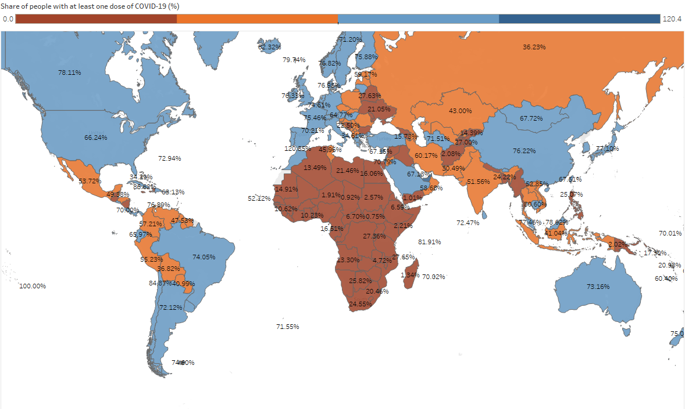
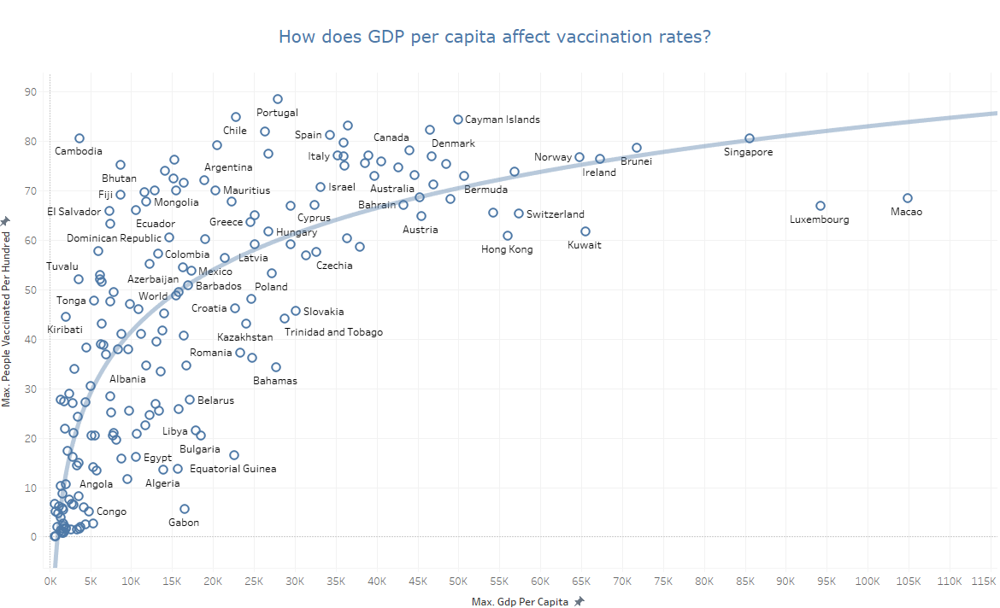
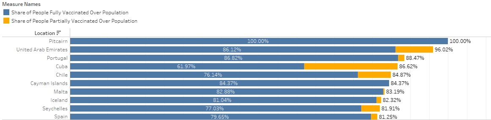
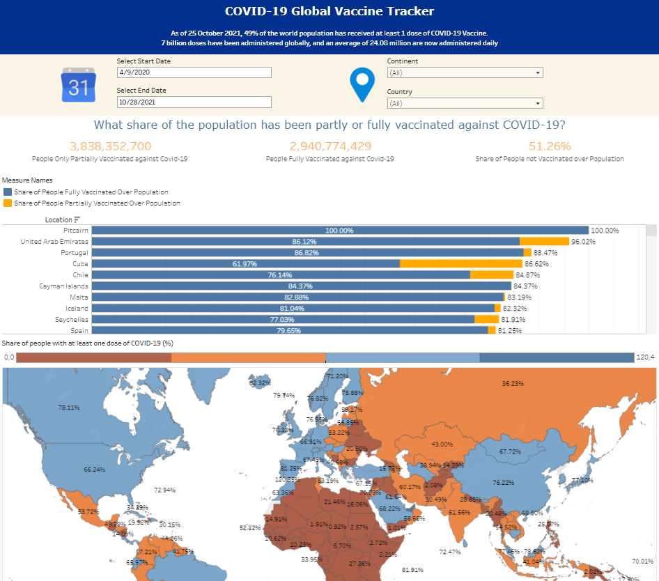

Badge [source](https://shields.io/)

# Key findings: Countries that are more developed, and have a higher income are more likely to have higher vaccination rates.

## Authors

- [@kennylam365](https://www.github.com/kennylam365)

## Table of Contents

  - [Business problem](#business-problem)
  - [Data source](#data-source)
  - [Quick glance at the results](#quick-glance-at-the-results)
  - [Interactive dashboard](#interactive-dashboard)
  - [Explore the visualizations](#explore-the-visualizations)

## Business problem

As a beginner data analyst from the World Health Organization (WHO), you are tasked by your team manager to look at the COVID-19 data and vaccination data to identify if there are any geographic, and/or economic factor that contributes to the vaccination rate of each country.

## Data source

- [Kaggle vaccination rate](https://www.kaggle.com/datasets/gpreda/covid-world-vaccination-progress)
- [Kaggle GDP per capita](https://www.kaggle.com/datasets/zgrcemta/world-gdpgdp-gdp-per-capita-and-annual-growths)
- [Kaggle positive cases](https://www.kaggle.com/datasets/georgesaavedra/covid19-dataset)

## Programs used

- Tableau (Data Visualizations)

## Quick glance at the results

Vaccination stat overview.

Vaccination stats map overview (little correlation between geographical location and vaccination rates).

Correlation between GDP per capita and vaccination rates = 0.638 correlation coefficient (Strong correlation).

Vaccination stats by country.

- **Wealthier countries and ones that have sustained economic growth tend to have higher vaccination rates**
- **Geographical location does not really affect vaccination rates. However, developing countries tend to have a lower vaccination rate**
- **Evidence suggests that wealth goes together with a higher vaccination rate**:
  Since the objective of this problem is to to identify if there are any geographic, and/or economic factor that contributes to the vaccination rate of each country, these are the stats I looked at:

  - Looking at the global map for vaccination rates, it can be seen that vaccination rates vary widely by country; there is little correlation between geographical location and vaccination rates. It can be concluded that geographical location is not a strong indicator of high vaccination rates.

  - Looking at the vaccination rates over GDP per capita scatterplot, the correlation coefficient of 0.638 implies there is a strong positive correlation between the countries' GDP per capita and vaccination rates. Richer countries tend to have higher vaccination rates, and vice versa. It can be concluded that a higher GDP per capita generally means higher vaccination rates for the country.

    ***Note***: Does not mean there is a causal effect, further analysis required.

    ***Conclusion***: While there is little correlation beween geographical location and vaccination rates, there is a strong positive correlation between country's economy and its vaccination rates.

## Interactive dashboard

Using tableau, I created an interactive dashboard to track the vaccination rates based on the geographical location, country and date. You can try it out with the link below.

[Covid-19 vaccination stats interactive dashboard](https://public.tableau.com/views/Covid-19_16770391519370/GlobalVaccineTracker_1?:language=en-US&:display_count=n&:origin=viz_share_link)

## Explore the visualizations

Please start from the COVID-19 Vaccination Data Analysis.pdf first, before trying out the interactive dashboard in tableau to have a better understanding of the data viz and dashboard.

To explore the visualizations in the tableau file [Covid-19.twbx](https://github.com/kennylam365/COVID-19-Vaccination-Analysis/blob/main/Covid-19.twbx)
## Repository structure

The raw data used are downloaded from kaggle, and the final combined raw data can be found [here](https://github.com/kennylam365/COVID-19-Vaccination-Analysis/blob/main/country_vaccinations_final_raw.zip)

Thank you for reading.
